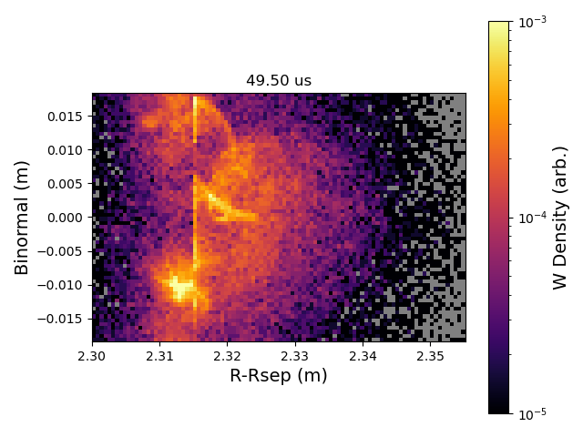

=========================================================================================
Beginner's Guide
=========================================================================================

Flan is a trace impurity transport code that is run on top of a pre-computed plasma background. As of now, that is provided by the gyrokinetic solver within Gkeyll. It is certainly beyond the scope of this guide to detail how to use Gkeyll, so instead we will walk through the steps used to obtain a generic Gkeyll simulation representative of the DIII-D far-SOL assuming you already have a working Gkeyll installation. 

If one is familiar with trace impurity transport codes like DIVIMP or ERO2.0, then one can think of the relationship between Gkeyll and Flan as similar to that between, say, SOLPS-ITER and ERO2.0. SOLPS-ITER is used to generate a (2D) background that is then used in ERO2.0 to follow a trace impurity like tungsten. Same idea, except Gkeyll provides the background plasma to Flan. Flan is more tightly coupled to Gkeyll though, in that it uses the same computational grid as Gkeyll. This facilitates coupling, and enables rather efficient simulations due to simplifications in translating between physical space and the computational field aligned space of Gkeyll with the metric coefficients (this is an implementation detail, do not worry too much about it at this point). 

Generating a Plasma Background with Gkeyll
------------------------------------------

This sectin provides an Gkeyll input file that generates a turbulent representation of a generic DIII-D far-SOL, #167196. The simulation has been benchmarked against experimental reciprocating Langmuir probe ne and Te data. See Zamperini, S. A., et al. Nucl. Fusion 64, 074002 (2024) for more details (this was actually for a prototype of Flan, but the background is more or less the same as what is supplied below).

Simulating Tungsten Transport with Flan
---------------------------------------

It is useful to create a directory to contain all your :literal:`flan` cases, it can be anywhere (don't put it in the repository directory, bad practice). For this section we will assume it is called :literal:`flandir`. Within :literal:`flandir`, you can use the following script to setup a simulation directory named :literal:`test`:

.. code-block:: bash

   (flan) $ /path/to/flan/scripts/flan_setup.sh test

This will create a directory called :literal:`test` and place the needed files in it. The input file is :literal:`test.cpp`. If you open this up, you will notice a function :literal:`mapc2p`, a function called :literal:`create_inputs` and :literal:`main`. For now, all you need to look at is :literal:`create_inputs`. This is where all the input options are entered. You will notice some input options are provided to get you started. It is good to be familiar with the Gkeyll simulation you are running :literal:`flan` with so that you can tell it where the impurities start. A possible bare-minimum set of input options could look like this:

.. code-block:: bash

  inpts["case_name"] = "test";
  inpts["imp_num"] = 10000;
  
  // Tell Flan where to find the Gkeyll files and how many to use. This is one
  // that used the simple helical approximation, so the coordinates are already
  // Cartesian (this means nothing needs to be done with mapc2p).
  inpts["gkyl_dir"] = "/home/zamp/gkyldir/d3d-167196-v6-gpu";
  inpts["gkyl_casename"] = "d3d-167196-v6-gpu";
  inpts["gkyl_frame_start"] = 600;
  inpts["gkyl_frame_end"] = 699;
  inpts["gkyl_elec_name"] = "elc";
  inpts["gkyl_ion_name"] = "ion";
  
  // Setup simulation to follow W ions
  inpts["imp_num"] = 10000
  inpts["imp_mass_amu"] = 183.84;
  
  // I know from this Gkeyll simulation that this corresponds to the "left"
  // or inner edge of the simulation, so start W ions there and we will
  // watch them transport from there.
  inpts["imp_xmin"] = 2.315;
  inpts["imp_xmax"] = 2.315;
  
  // Randomly start the ions anywhere in the y direction
  inpts["imp_ystart_opt"] = "range";
  
  // Need to know where to find the ADAS files and what year to use
  inpts["openadas_root"] = "/home/zamp/flandir/openadas";
  inpts["openadas_year"] = 50;

You can leave the rest of the input file alone for now. To run the simulation, you must compile it first to create an executable, then run the executable. This is easily done (don't forget to make sure the :literal:`flan` conda environment is active):

.. code-block:: bash

  (flan) $ make
  (flan) $ ./test

Once finished, we can plot the data using the provided :literal:`flan_plots` python plotting library. Note: You must have the :literal:`flan` conda environment active

.. code-block:: bash

  (flan) $ ipython
  In [1]: import flan_plots
  In [2]: fp = flan_plots.FlanPlots("test.nc")
  In [3]: fp.plot_frames_xy("imp_density", 0, 99, 0.0, animate_cbar=True, vmin=1e-6, vmax=1e-3, norm_type="log", xlabel="R-Rsep (m)", ylabel="Binormal (m)", cbar_label="W Density (arb.)")

This creates an animated plot, a screenshot of which is shown below.

Data can be extracted for more detailed analysis. This will be covered in future :literal:`flan_plots` documentation (one day).

